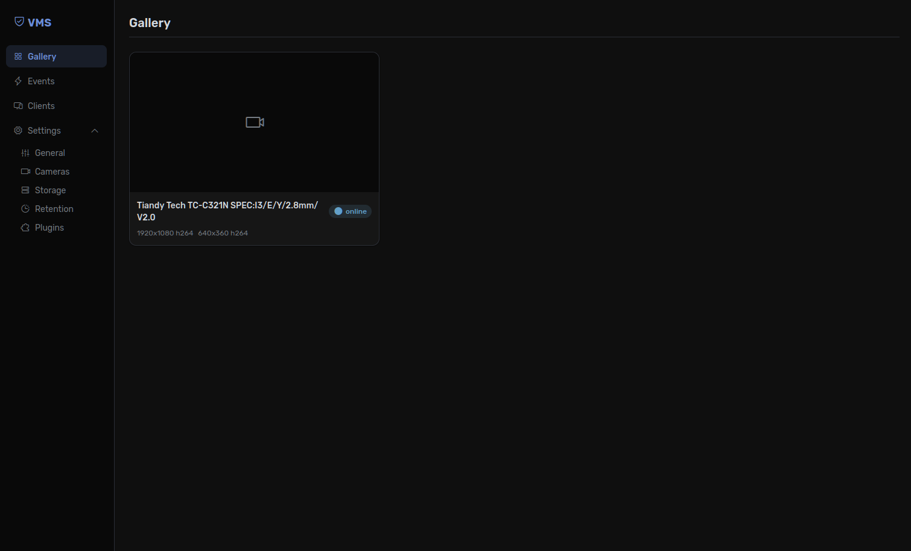

# VMS

A network video management system for home and power users. Supports up to 32 cameras on a single node with no transcoding, minimal resource usage, and first-class ONVIF support.

> **Note:** This project is under active development. Not all documented features are implemented yet, and APIs may change without notice.



## Highlights

- **Zero transcoding** -- video passes through as raw data units; the server never decodes or re-encodes
- **Single port access** -- all native client communication (API, live video, playback, events) multiplexed over one TCP/TLS port
- **Plugin-first architecture** -- capture, storage, formats, analytics, auth, and notifications are all behind extension point interfaces with no privileged internal code paths
- **Cross-platform clients** -- native desktop (Windows, Linux, macOS), mobile (Android, iOS), and web UI
- **Mutual TLS** -- clients authenticate with certificates signed by a server-generated root CA; revocation is immediate
- **Network-storage-safe** -- sequential writes, no mmap, no flock; runs directly against NFS or SMB mounts
- **CPU-only by default** -- runs efficiently on hardware without a GPU

## Documentation

See the [`docs/`](docs/) directory for architecture, deployment, API reference, protocol specification, and more.

## Getting Started

### Prerequisites

- [.NET 10 SDK](https://dotnet.microsoft.com/)
- [Node.js 22+](https://nodejs.org/) (for web UI)

### Build

```bash
./build.sh build     # build
./build.sh test      # run tests
./build.sh publish   # publish to out/
```

### Run

```bash
./out/server/server
./out/server/server --data-path /mnt/nas/data
```

On first run, the web UI at `http://localhost:8080` serves a setup wizard to configure the data provider and generate certificates. After setup, discover cameras or add them manually.

See [Deployment](docs/deployment.md) for Docker Compose, systemd, and other installation methods.

## Technology Stack

| Component      | Technology                                      |
| -------------- | ----------------------------------------------- |
| Server         | .NET 10, ASP.NET Core (Kestrel)                 |
| Transport      | TCP + TLS 1.3 (SslStream), mutual TLS           |
| Serialization  | MessagePack (tunnel framing), JSON (API bodies) |
| Database       | Pluggable via `IDataProvider` (SQLite included) |
| Web UI         | Vue.js 3 + Vite                                 |
| Native clients | Avalonia UI + LibVLCSharp                       |

## Contributing

See [CONTRIBUTING.md](CONTRIBUTING.md) for guidelines on submitting changes, issues, etc.

## License

This project is licensed under the [MIT License](LICENSE).
