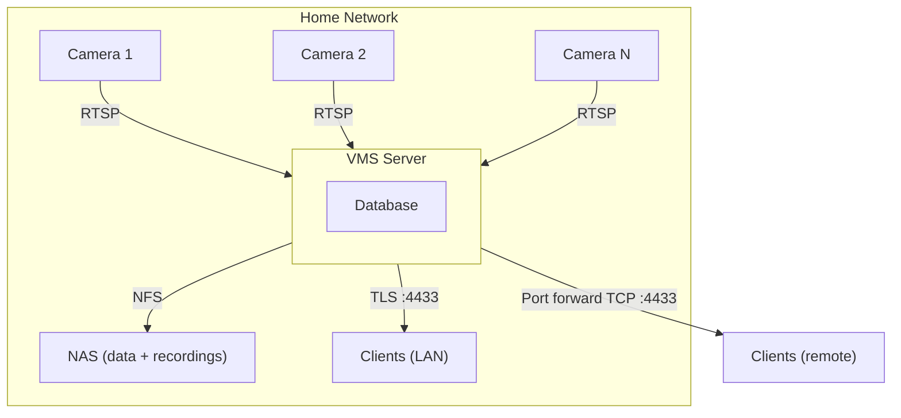
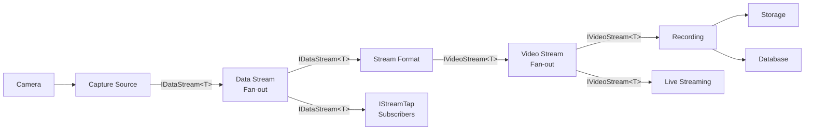
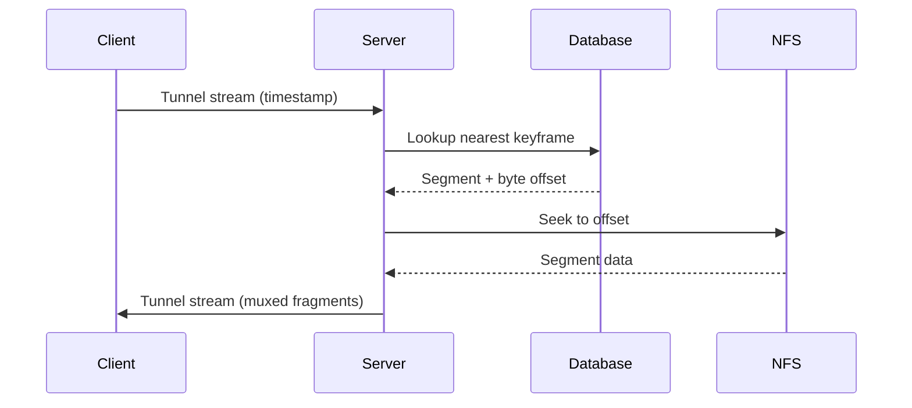

# Architecture

## Overview

A network video management system designed for home and power users. It supports up to 32 cameras on a single node with no transcoding, minimal resource usage, and first-class ONVIF support.

## Design Principles

- **No transcoding** - video passes through as opaque data units; the server never decodes or re-encodes
- **Single port access** - all client communication (API, live video, playback, events) over one TCP/TLS port
- **Plugin-first** - all major subsystems (capture, storage, formats, detection) are behind extension point interfaces; there are no privileged internal code paths
- **CPU-only by default** - the server must run efficiently on hardware without a GPU; hardware acceleration is a future plugin concern
- **Containers first, native supported** - Docker/Podman is the primary deployment, but the server runs as a standalone binary with no container dependency

## Technology Stack

| Component | Technology | Notes |
|-----------|-----------|-------|
| Server runtime | .NET 10 | LTS, cross-platform, AOT-capable |
| Server framework | ASP.NET Core (Kestrel) | HTTP for web UI; TCP+TLS tunnel for native clients |
| Database | Pluggable via `IDataProvider` | Metadata, indexes, config |
| Web UI | Vue.js 3 + Vite | Embedded SPA served by Kestrel |
| Client framework | Avalonia UI | Shared core + per-platform shells |
| Client video | LibVLCSharp | Hardware-accelerated decode on client devices |
| Secure transport | TCP + TLS 1.3 (SslStream) | Mutual TLS, multiplexed, single TCP port |

## System Topology



## Server Architecture

### Module Overview

```
Shared.Models             > Domain models, DTOs, extension point interfaces, events
Shared.Models/Formats     > Typed data unit and format parameter types for plugin interop
Shared.Protocol           > Tunnel protocol definitions, framing, stream types

Server                    > ASP.NET Core host, startup, DI composition
Server.Core               > Domain services, orchestration, scheduling
Server.Api                > HTTP endpoints (web UI, enrollment), middleware
Server.Onvif              > ONVIF client (discovery, device, media, events, analytics)
Server.Streaming          > Stream pipeline orchestration, data/video stream fan-out
Server.Recording          > Segment writer, keyframe indexer, retention engine
Server.Tunnel             > TCP+TLS listener, mutual TLS, stream dispatch
Server.Plugins            > Plugin host, discovery, lifecycle management

Client.Core               > ViewModels, services, shared controls (Avalonia)
Client.Desktop            > Windows/Linux/macOS shell, tray, desktop VPN
Client.Android            > Android shell, notifications, QR scanning
Client.iOS                > iOS shell, notifications, QR scanning

Client.Web                > Vue.js SPA (built assets embedded in Server)
```

### Error Propagation

All internal interfaces return `OneOf<T, Error>` for anticipated failure conditions (not found, conflicts, storage failures). The `Error` type carries a `Result` code, `DebugTag`, and message - the same structure used in the API response envelope. At the API boundary, `OneOf<T, Error>` is converted to a `ResponseEnvelope` for the wire. Unanticipated failures (bugs, invariant violations) remain as exceptions and are not caught. See [response-model.md](response-model.md) for details.

### Stream Pipeline

The server builds a per-stream processing pipeline by wiring together compatible plugins. Each stage produces a typed stream that the next stage consumes. The server core matches plugins by their declared input/output types and assembles the pipeline automatically.



1. The camera provider identifies available streams and their codecs
2. The server matches an `ICaptureSource` plugin by protocol and connects
3. The capture source handles all transport concerns (e.g. RTSP negotiation, RTP depacketization) and produces a typed data stream (`IDataStream<T>`)
4. The data stream fans out to `IStreamTap` subscribers and to the matched `IStreamFormat` plugin
5. The `IStreamFormat` muxes the data stream into a container format, producing a typed video stream (`IVideoStream<T>`)
6. The video stream fans out to the recording pipeline and live stream handlers

### Data Flow: Playback



### Internal Event Bus

The server uses `System.Threading.Channels` for internal pub/sub:

- `CameraStatusChanged` - camera online/offline/error
- `CameraAdded` - new camera registered
- `CameraRemoved` - camera deleted
- `CameraConfigChanged` - camera configuration updated (credentials, streams, RTSP port)
- `StreamStarted` / `StreamStopped`
- `RecordingSegmentCompleted` - new segment written
- `MotionDetected` / `MotionEnded`
- `OnvifEvent` - raw ONVIF events (tamper, analytics, I/O)
- `ClientConnected` / `ClientDisconnected`

The streaming and recording subsystems subscribe to camera lifecycle events for dynamic reconfiguration. When a camera is added, removed, or its configuration changes, pipelines and recording writers are reconciled without requiring a server restart.

Plugins subscribe to these channels to react to system events. The event bus is in-process only (not distributed - single node design).

### Stream Profiles

A camera exposes multiple stream profiles, which fall into two categories:

**Quality profiles** (`main`, `sub`, etc.) - video streams at different resolutions/bitrates. The client subscribes to one at a time, typically choosing based on network conditions (e.g. `sub` on cellular, `main` on LAN). Each quality profile has its own retention policy (e.g. keep `main` for 30 days, `sub` for 90 days).

**Metadata profiles** (`motion`, etc.) - non-video data streams produced from camera analytics. These use the same subscription, recording, and playback pipeline as quality profiles but with a different `IStreamFormat` implementation suited to their data. The client subscribes to a metadata profile alongside a quality profile and renders it as an overlay.

Metadata profiles do not have their own retention. A metadata segment is retained as long as any quality profile has a corresponding segment covering that time range - when the last overlapping quality segment is purged, the metadata segment is purged with it.

The ONVIF provider registers a `motion` profile on cameras that support analytics metadata. The motion data (active cell grids, regions) is recorded as timestamped segments and can be played back in sync with video.

### Recording: Segments

Recordings are stored as segments in the container format produced by the active `IStreamFormat` plugin:

- No transcoding - data units from the capture source are muxed into a container format by the format plugin
- 5-minute segments by default (configurable per camera, actual duration rounds to the nearest sync point boundary)
- Each segment is independently playable
- Sync point byte offsets indexed in the database for sub-second seek

The recording pipeline subscribes to the video stream fan-out. It accumulates muxed output into segment files via `IStorageProvider`, tracks sync point byte offsets as they are written, and finalizes the segment when the duration target is reached.

### Storage Layout

The server host is stateless - all persistent data lives on configured storage paths (local or network). The server's I/O patterns are network-storage-safe (sequential writes, no mmap, no filesystem locking, latency tolerant).

The server takes a single `--data-path` argument for core data (certs, plugins). The recordings path is configured through the `IStorageProvider` plugin via the database.

```
{data-path}/
  certs/                               # root CA, server cert, client certs
  plugins/                             # plugin assemblies
```

The recordings path layout is managed by the `IStorageProvider` plugin. The layout below is an example from a filesystem provider - other providers may organize data differently:

```
{recordings-path}/
  {camera_uuid}/
    {stream_profile}/                  # "main", "sub", etc.
      {year}/{month}/{day}/
        {timestamp}.mp4                # e.g. 20260315T140000Z.mp4
```

- Flat date directories for simple manual inspection
- Lexicographic filename sort equals chronological sort
- Metadata storage is managed by the `IDataProvider` plugin
- Server can be rebuilt/replaced without data loss - just point at the same storage and start

### Retention Engine

Runs periodically (configurable interval, default 15 minutes). Per-camera retention policies:

| Mode | Behavior |
|------|----------|
| `days` | Delete segments older than N days |
| `bytes` | Delete oldest segments when total exceeds N bytes |
| `percent` | Delete oldest segments when mount usage exceeds N% |

Policies are evaluated in order: days first, then size/percent. Deletion is oldest-first within each camera's segments.

Retention is configured per quality profile - different profiles can have different policies (e.g. keep `main` for 30 days, `sub` for 90 days). Metadata profiles (`motion`, etc.) do not have their own retention. A metadata segment is retained as long as any quality profile has a segment covering the same time range. When the last overlapping quality segment is purged, the metadata segment is purged with it.

## Plugin System

See [plugins.md](plugins.md) for full specification.

### Extension Points

| Interface | Purpose | Included Plugins |
|-----------|---------|-----------------|
| `ICaptureSource` | Connect to a source, produce typed `IDataStream<T>` | RTSP (TCP interleaved) |
| `IStreamFormat` | Consume `IDataStream<T>`, produce typed `IVideoStream<T>` | fMP4 (H.264/H.265) |
| `ICameraProvider` | Camera-specific behavior, discovery | ONVIF, Generic RTSP |
| `IEventFilter` | Process and filter events | Motion zone filter |
| `INotificationSink` | Deliver notifications | Client push (tunnel) |
| `IVideoAnalyzer` | Analyze video frames (requires decode) | None (future) |
| `IStorageProvider` | Read/write recordings | NFS/local filesystem |
| `IDataProvider` | Metadata storage (cameras, segments, events, config, etc.) | SQLite |
| `IAuthProvider` | Authenticate HTTP/web UI requests | None (unauthenticated by default) |
| `IAuthzProvider` | Authorize operations and filter results by identity | Client-type RBAC (no provider = unrestricted access) |

### Plugin Services

Plugins receive these services from the plugin host via `PluginContext` (see [plugins.md](plugins.md)):

| Service | Purpose |
|---------|---------|
| `IEventBus` | Publish and subscribe to system events |
| `IStreamTap` | Subscribe to raw data streams (`IDataStream`) from cameras |
| `IRecordingAccess` | Query and read recording segments |
| `ICameraRegistry` | Enumerate cameras and stream profiles |
| `IConfig` | Read and write plugin-specific configuration |
| `IDataStore` | Per-plugin isolated key-value/document store for internal state |

### Plugin Loading

- Plugins are .NET assemblies placed in the `plugins/` directory
- Each assembly contains a class implementing `IPlugin`
- The plugin host discovers, loads, and manages plugin lifecycle
- A plugin provides extension points by implementing the corresponding interfaces on its `IPlugin` class
- All plugins use the same interfaces (no privileged internal paths)

## Security Model

- TCP transport with mutual TLS (client certificates)
- Server generates a self-signed root CA on first run
- Each client receives a unique certificate signed by the root CA
- Certificate revocation is immediate (delete client record, reject on next handshake)
- ONVIF camera credentials stored encrypted in the database
- Web UI accessible on local network only (HTTP, unauthenticated by default - pluggable via `IAuthProvider`)
- Enrollment via QR code (mobile) or short token over LAN (desktop)

### Threat Model

In scope: tunnel traffic confidentiality (LAN and WAN) and client authentication at the tunnel port.

Out of scope: LAN-resident attackers and compromised cameras pivoting into the server. Administrative surfaces (web UI, enrollment, setup wizard) trust LAN position; maintaining that boundary is an operator concern (see [security.md](security.md)).

## Resource Budget (32 cameras)

Target resource usage for 32 cameras, dual stream each (main 1080p + sub 360p):

| Resource | Budget | Notes |
|----------|--------|-------|
| CPU | < 2 cores sustained | No decode; transport demux + container mux only |
| Memory | < 512 MB | Per-stream buffers (~2 MB each), DB pool, framework |
| Disk I/O | Pass-through | Bound by camera bitrate sum, written to NFS |
| Network (ingest) | ~256 Mbps | 32 × 8 Mbps main + 32 × 512 Kbps sub |
| Network (client) | Per viewer | One stream per live view |
| Tunnel port | 1 TCP | All client communication |
| HTTP port | 1 TCP | Web UI only (LAN) |
