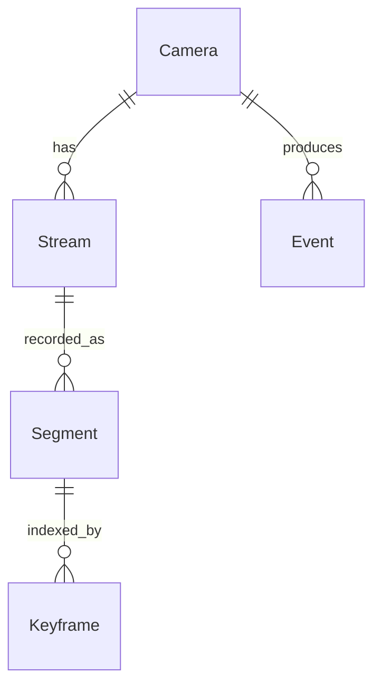

# Data Model

## Overview

This document defines the entities, relationships, and query patterns that any `IDataProvider` implementation must support. It is database-engine agnostic - the provider chooses its own schema, storage format, and query language.

## Conventions

All timestamps are stored as **Unix microseconds** (`ulong`) - microseconds since 1970-01-01T00:00:00Z. This is consistent with the QUIC protocol timestamp format (see [protocol.md](protocol.md)) and avoids timezone/precision ambiguity across database engines.

## Entities

### Camera

Represents a registered camera.

| Field | Type | Description |
|-------|------|-------------|
| `Id` | Guid | Primary key |
| `Name` | string | User-assigned display name |
| `Address` | string | Camera IP/hostname |
| `ProviderId` | string | Camera provider plugin that manages this camera |
| `Credentials` | encrypted blob | Camera username/password |
| `SegmentDuration` | int? | Recording segment duration in seconds (null = use server default) |
| `Capabilities` | string[] | Camera capabilities (e.g. `ptz`, `audio`, `events`) - populated by the camera provider during configuration |
| `Config` | map | Provider-specific configuration (opaque to core) |
| `RetentionMode` | enum | `Default`, `Days`, `Bytes`, `Percent` - `Default` uses global setting |
| `RetentionValue` | long | Threshold value (ignored when mode is `Default`) |
| `CreatedAt` | ulong | Unix microseconds |
| `UpdatedAt` | ulong | Unix microseconds |

### Stream

Represents a stream profile on a camera. A camera has one or more streams. Streams are either quality profiles (video at different resolutions) or metadata profiles (motion data, etc.).

| Field | Type | Description |
|-------|------|-------------|
| `Id` | Guid | Primary key |
| `CameraId` | Guid | Foreign key > Camera |
| `Profile` | string | Profile name (e.g. `main`, `sub`, `motion`) |
| `Kind` | enum | `Quality` or `Metadata` |
| `FormatId` | string | `IStreamFormat` identifier (e.g. `fmp4`, `motion-grid`) |
| `Codec` | string? | Codec identifier (e.g. `h264`, `h265`); null for metadata profiles |
| `Resolution` | string? | e.g. `1920x1080`; null for metadata profiles |
| `Fps` | int? | Frames per second; null for metadata profiles |
| `Bitrate` | int? | Bitrate in kbps (if known) |
| `Uri` | string | Source URI |
| `RecordingEnabled` | bool | Whether this stream is being recorded |

### Segment

Represents a recorded video segment file. The `SegmentRef` is an opaque string provided by the storage plugin - the data model does not interpret it.

| Field | Type | Description |
|-------|------|-------------|
| `Id` | Guid | Primary key |
| `StreamId` | Guid | Foreign key > Stream |
| `StartTime` | ulong | Unix microseconds |
| `EndTime` | ulong | Unix microseconds |
| `SegmentRef` | string | Opaque reference from `IStorageProvider` |
| `SizeBytes` | long | Segment file size |
| `KeyframeCount` | int | Number of keyframes in this segment |

### Keyframe

Index of keyframe positions within a segment, enabling fast seek.

| Field | Type | Description |
|-------|------|-------------|
| `SegmentId` | Guid | Foreign key > Segment |
| `Timestamp` | ulong | Unix microseconds |
| `ByteOffset` | long | Byte offset within the segment file |

### Event

A camera event (motion, tamper, analytics, disconnect, etc.).

| Field | Type | Description |
|-------|------|-------------|
| `Id` | Guid | Primary key |
| `CameraId` | Guid | Foreign key > Camera |
| `Type` | string | Event type identifier |
| `StartTime` | ulong | Unix microseconds |
| `EndTime` | ulong? | Unix microseconds (null if instantaneous or ongoing) |
| `Metadata` | map? | Type-specific data (opaque to core) |

### Client

An enrolled client device.

| Field | Type | Description |
|-------|------|-------------|
| `Id` | Guid | Primary key (same as `clientId` in enrollment) |
| `Name` | string | User-assigned display name |
| `CertificateSerial` | string | Serial number of the issued client certificate |
| `Revoked` | bool | Whether this client's access has been revoked |
| `EnrolledAt` | ulong | Unix microseconds |
| `LastSeenAt` | ulong? | Unix microseconds, last successful connection |

## Relationships

## Required Query Patterns

The `IDataProvider` exposes repository interfaces. Each repository must support the query patterns listed below. The provider translates these into whatever query mechanism its backing store supports.

### ICameraRepository

| Operation | Description |
|-----------|-------------|
| `GetAll()` | List all cameras |
| `GetById(id)` | Get a single camera by ID |
| `GetByAddress(address)` | Find a camera by its address (for duplicate detection) |
| `Create(camera)` | Insert a new camera |
| `Update(camera)` | Update camera fields |
| `Delete(id)` | Remove a camera and cascade to streams, segments, keyframes, events |

### IStreamRepository

| Operation | Description |
|-----------|-------------|
| `GetByCameraId(cameraId)` | List all streams for a camera |
| `GetById(id)` | Get a single stream |
| `Upsert(stream)` | Create or update a stream (used during camera config sync) |
| `Delete(id)` | Remove a stream |

### ISegmentRepository

| Operation | Description |
|-----------|-------------|
| `GetByTimeRange(streamId, from, to)` | List segments overlapping a time range, ordered by start time |
| `GetOldest(streamId, limit)` | Get the oldest N segments (for retention) |
| `GetTotalSize(streamId)` | Sum of `SizeBytes` for all segments of a stream |
| `Create(segment)` | Insert a new segment |
| `DeleteBatch(ids)` | Remove segments by ID (batch, for retention) |

### IKeyframeRepository

| Operation | Description |
|-----------|-------------|
| `GetBySegmentId(segmentId)` | List all keyframes in a segment, ordered by timestamp |
| `GetNearest(segmentId, timestamp)` | Find the keyframe at or before a timestamp (for seek) |
| `CreateBatch(keyframes)` | Insert keyframes for a completed segment (batch) |
| `DeleteBySegmentIds(segmentIds)` | Remove keyframes when segments are purged |

### IEventRepository

| Operation | Description |
|-----------|-------------|
| `Query(cameraId?, type?, from, to, limit, offset)` | Filtered, paginated event query |
| `GetById(id)` | Get a single event |
| `Create(event)` | Insert an event |
| `GetByTimeRange(cameraId, from, to)` | Events within a range (for timeline overlay) |

### IClientRepository

| Operation | Description |
|-----------|-------------|
| `GetAll()` | List all non-revoked clients |
| `GetById(id)` | Get a single non-revoked client |
| `GetByCertificateSerial(serial)` | Look up client by cert serial, including revoked (used during TLS handshake to reject revoked certs) |
| `Create(client)` | Insert a new client |
| `Update(client)` | Update client fields (name, lastSeen, revoked) |

### ISettingsRepository

Key-value settings store for server-level configuration.

| Operation | Description |
|-----------|-------------|
| `Get(key)` | Get a setting value |
| `GetAll()` | Get all settings |
| `Set(key, value)` | Create or update a setting |
| `Delete(key)` | Remove a setting |

### IPluginDataStore

Generic key-value/document store for plugins to persist internal state (accounts, sessions, learned data, etc.) without bringing their own database. Every `IDataProvider` must implement this.

Each plugin gets an isolated namespace - a plugin can only access its own data.

Plugins that prefer to manage their own storage (separate database, files, etc.) are free to do so - they should expose the relevant paths or connection details as user-facing configuration via `IPluginConfig`.

| Operation | Description |
|-----------|-------------|
| `Get<T>(key)` | Get a value by key, deserialized to `T` |
| `GetAll<T>(prefix?)` | List all entries, optionally filtered by key prefix |
| `Set<T>(key, value)` | Create or update a value |
| `Delete(key)` | Remove a value |
| `Query<T>(predicate)` | Find entries matching a predicate (provider may support limited query expressiveness) |

The serialization format is provider-defined (JSON, MessagePack, etc.). Plugins work with typed objects; the provider handles serialization.

This is how, for example, the `IAuthzProvider` plugin stores accounts and role assignments - those are plugin concerns, not core data model entities.

## Performance Considerations

The following queries are performance-critical and providers should optimize for them:

- **`ISegmentRepository.GetByTimeRange`** - called on every playback seek and timeline render. Must be fast over large time ranges with many segments.
- **`IKeyframeRepository.GetNearest`** - called on every seek operation. Must return in sub-millisecond time for a typical segment (~60 keyframes per 5-minute segment at 1 GOP/2s).
- **`IEventRepository.GetByTimeRange`** - called on every timeline render. Must handle cameras with high event rates (continuous motion).
- **`ISegmentRepository.GetOldest`** and **`GetTotalSize`** - called by the retention engine on a regular interval. Should not block recording.

## Migration Contract

Each `IDataProvider` implements `MigrateAsync()` which is called on server startup. The provider is responsible for:

- Creating the schema on first run
- Migrating from older schema versions when the server is upgraded
- Making migrations safe to run concurrently (in case of multiple startup attempts)

The server does not dictate a migration framework - the provider uses whatever is appropriate for its backing store.
