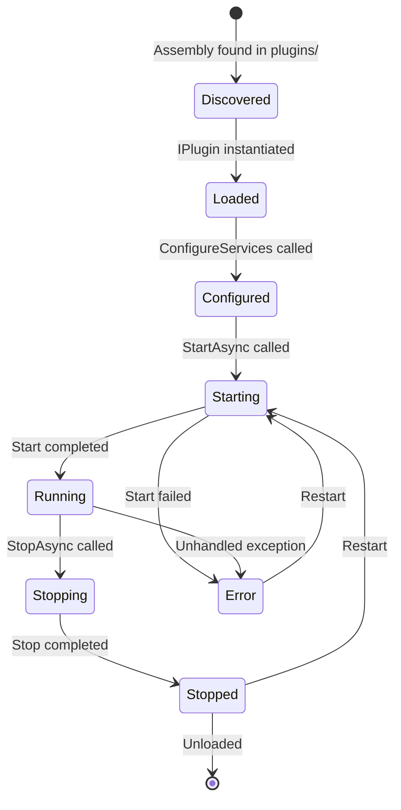

# Plugin System

## Overview

The server is built around a plugin architecture. All major subsystems - capture sources, recording formats, camera providers, notification delivery, analytics, authentication, authorization - are behind extension point interfaces. Built-in functionality ships as internal plugins that use the same interfaces as third-party plugins. There are no privileged internal code paths.

This means the server core is a host that wires plugins together, manages lifecycle, and provides shared services. All domain behavior lives in plugins.

## Plugin Structure

A plugin is a .NET assembly containing one or more classes that implement extension point interfaces. Each plugin has a single entry point class implementing `IPlugin`.

```csharp
public interface IPlugin
{
    PluginMetadata Metadata { get; }
    OneOf<Success, Error> ConfigureServices(IServiceCollection services);
    Task<OneOf<Success, Error>> StartAsync(CancellationToken ct);
    Task<OneOf<Success, Error>> StopAsync(CancellationToken ct);
}
```

`Metadata` provides the plugin's identity:

```csharp
public record PluginMetadata
{
    public required string Id { get; init; }
    public required string Name { get; init; }
    public required string Version { get; init; }
    public string? Description { get; init; }
}
```

## Lifecycle



1. **Discovered** - the plugin host scans the `plugins/` directory for assemblies containing `IPlugin` implementations.
2. **Loaded** - the `IPlugin` class is instantiated.
3. **Configured** - `ConfigureServices` is called. The plugin registers its extension point implementations into a scoped `IServiceCollection`.
4. **Running** - `StartAsync` completes. The plugin is active and its registered services are available to the system.
5. **Stopped** - `StopAsync` completes. Services are removed from the container.

Built-in plugins follow the same lifecycle but are discovered from the server assembly rather than the `plugins/` directory.

## Extension Points

Extension points are interfaces defined in the `Shared.Models` assembly. Any plugin can provide one or more implementations. When multiple plugins implement the same extension point, the system uses all of them (e.g. multiple `INotificationSink` implementations each receive events) unless the extension point is singular by design (e.g. `IAuthzProvider`).

### ICaptureSource

Acquires video from a source and produces raw NAL units.

```csharp
public interface ICaptureSource
{
    string Protocol { get; }
    Task<OneOf<IStreamConnection, Error>> ConnectAsync(CameraConnectionInfo info, CancellationToken ct);
}

public interface IStreamConnection : IAsyncDisposable
{
    Task<OneOf<IAsyncEnumerable<NalUnit>, Error>> ReadNalUnitsAsync(CancellationToken ct);
    StreamInfo Info { get; }
}
```

The built-in implementation handles RTSP over TCP interleaved. A plugin could implement capture from files, RTMP, or proprietary protocols.

### IStreamFormat

Muxes stream data into a container format for storage and demuxes for playback. Handles any streamable data type - video (H.264/265), audio, motion metadata, or future data types.

```csharp
public interface IStreamFormat
{
    string FormatId { get; }
    string FileExtension { get; }
    OneOf<ISegmentWriter, Error> CreateWriter(Stream output, CodecInfo codec);
    OneOf<ISegmentReader, Error> CreateReader(Stream input);
}

public interface ISegmentWriter : IAsyncDisposable
{
    Task<OneOf<Success, Error>> WriteNalUnitAsync(NalUnit unit, CancellationToken ct);
    Task<OneOf<Success, Error>> FinalizeAsync(CancellationToken ct);
    IReadOnlyList<KeyframeEntry> Keyframes { get; }
}

public interface ISegmentReader : IAsyncDisposable
{
    Task<OneOf<Success, Error>> SeekToKeyframeAsync(long byteOffset, CancellationToken ct);
    Task<OneOf<IAsyncEnumerable<Fragment>, Error>> ReadFragmentsAsync(CancellationToken ct);
}
```

The built-in implementation produces fragmented MP4 for video streams. Metadata profiles (e.g. motion) use a lightweight format suited to their data type. A plugin could add MKV, raw HEVC, or other formats.

### ICameraProvider

Handles camera-specific discovery, configuration, and capability detection.

```csharp
public interface ICameraProvider
{
    string ProviderId { get; }
    Task<OneOf<IReadOnlyList<DiscoveredCamera>, Error>> DiscoverAsync(DiscoveryOptions options, CancellationToken ct);
    Task<OneOf<CameraConfiguration, Error>> ConfigureAsync(string address, Credentials credentials, CancellationToken ct);
    Task<OneOf<IEventSubscription?, Error>> SubscribeEventsAsync(CameraConfiguration config, CancellationToken ct);
}
```

Built-in implementations: ONVIF (full discovery, events, analytics) and Generic RTSP (manual URI, no discovery). A plugin could add vendor-specific providers (e.g. Amcrest, Reolink) that expose features not available through standard ONVIF.

### IEventFilter

Processes raw events before they are stored or delivered to clients. Filters can suppress, modify, or enrich events.

```csharp
public interface IEventFilter
{
    string FilterId { get; }
    Task<OneOf<EventDecision, Error>> ProcessAsync(CameraEvent rawEvent, CancellationToken ct);
}

public enum EventDecision
{
    Pass,
    Suppress,
}
```

Built-in: motion zone filter (suppress motion events outside configured regions). Plugins could add object detection filtering, time-based schedules, or deduplication.

### INotificationSink

Delivers event notifications to external systems. All registered sinks receive events that pass filtering.

```csharp
public interface INotificationSink
{
    string SinkId { get; }
    Task<OneOf<Success, Error>> SendAsync(CameraEvent evt, CancellationToken ct);
}
```

Built-in: client push over QUIC (event channel stream). Plugins could add email (SMTP), webhooks, Pushover, Telegram, etc.

### IVideoAnalyzer

Extension point for features that require decoding and analyzing video (object detection, face recognition, license plate reading, etc.).

```csharp
public interface IVideoAnalyzer
{
    string AnalyzerId { get; }
    IReadOnlyList<string> SupportedCodecs { get; }
    Task<OneOf<Success, Error>> StartAsync(Guid cameraId, string profile, CancellationToken ct);
    Task<OneOf<Success, Error>> StopAsync(Guid cameraId, string profile, CancellationToken ct);
}
```

No built-in implementation. The analyzer is responsible for its own pipeline: it subscribes to raw NAL units via `IStreamTap`, decodes them (CPU or GPU), performs analysis, and publishes results to `IEventBus`. The server never decodes video - that is entirely the analyzer plugin's concern.

Analysis results flow through the normal event filter > notification pipeline.

### IStorageProvider

An opaque store for recording data. The provider manages its own internal path/key scheme - callers identify data by metadata (camera, profile, time range), not paths. The provider is instantiated with whatever configuration it needs (mount point, bucket, connection string, etc.).

```csharp
public interface IStorageProvider
{
    string ProviderId { get; }

    Task<OneOf<ISegmentHandle, Error>> CreateSegmentAsync(SegmentMetadata metadata, CancellationToken ct);
    Task<OneOf<Stream, Error>> OpenReadAsync(string segmentRef, CancellationToken ct);
    Task<OneOf<Success, Error>> PurgeAsync(IReadOnlyList<string> segmentRefs, CancellationToken ct);
    Task<OneOf<StorageStats, Error>> GetStatsAsync(CancellationToken ct);
}

public interface ISegmentHandle : IAsyncDisposable
{
    string SegmentRef { get; }
    Stream Stream { get; }
    Task<OneOf<Success, Error>> FinalizeAsync(CancellationToken ct);
}

public record SegmentMetadata
{
    public required Guid CameraId { get; init; }
    public required string Profile { get; init; }
    public required ulong StartTime { get; init; }
    public required string Codec { get; init; }
}

public record StorageStats
{
    public required long TotalBytes { get; init; }
    public required long UsedBytes { get; init; }
    public required long FreeBytes { get; init; }
    public required long RecordingBytes { get; init; }
}
```

`CreateSegmentAsync` receives metadata describing what is being stored. The provider decides internally how to organize the data (directory structure, S3 keys, database blobs, etc.) and returns a handle with an opaque `SegmentRef` string. This ref is stored in the database index and used for all subsequent reads and deletes - the caller never knows or cares how the provider maps it to physical storage.

The retention engine (part of the server core) subscribes to `RecordingSegmentCompleted` events and periodically evaluates retention policies. It determines *which* segments to delete (based on age, total size, or free space percentage) and calls `PurgeAsync` with the opaque segment refs.

**Storage duration estimation:** The server tracks recording byte rate over a rolling window (bytes written per unit time, per camera). Combined with `FreeBytes` from `StorageStats`, this gives an estimated remaining recording duration. This calculation lives in the server core - the provider just reports accurate space figures.

Built-in: filesystem (covers NFS, local, any mounted filesystem). Plugins could add S3, SMB, or other backends. Non-filesystem backends may not support all space reporting - `TotalBytes` and `FreeBytes` can return `-1` to indicate "unknown", in which case percentage-based retention and duration estimation are unavailable.

### IDataProvider

Provides metadata storage for the server - cameras, streams, segments, events, clients, retention rules, settings, and any other structured data. The server core works against this abstraction; the specific database engine is an implementation detail.

```csharp
public interface IDataProvider
{
    string ProviderId { get; }

    ICameraRepository Cameras { get; }
    IStreamRepository Streams { get; }
    ISegmentRepository Segments { get; }
    IKeyframeRepository Keyframes { get; }
    IEventRepository Events { get; }
    IClientRepository Clients { get; }
    ISettingsRepository Settings { get; }

    IPluginDataStore GetPluginStore(string pluginId);

    Task<OneOf<Success, Error>> MigrateAsync(CancellationToken ct);
}
```

Each repository interface defines the queries the server core needs (CRUD, time-range queries, keyframe lookups, etc.). See [data-model.md](data-model.md) for the full return type contracts.

`MigrateAsync` is called on startup to ensure the schema is up to date. The provider owns its own migration strategy.

The data provider manages its own storage - a SQL-based provider manages its own database files/connections, a cloud-based provider manages its own credentials and endpoints. The server core does not dictate where or how the data is stored, only what queries it needs to perform.

### IAuthProvider

Authenticates HTTP requests. When no auth provider is installed, HTTP endpoints are unauthenticated.

```csharp
public interface IAuthProvider
{
    Task<OneOf<AuthResult, Error>> AuthenticateAsync(HttpContext context, CancellationToken ct);
    Task<OneOf<Success, Error>> ChallengeAsync(HttpContext context, CancellationToken ct);
}

public record AuthResult(bool Authenticated, string? Identity, IDictionary<string, string>? Claims);
```

No built-in implementation - HTTP is open on LAN by default. Plugins could add basic auth, OIDC, LDAP, or a simple PIN gate.

### IAuthzProvider

Authorizes operations and filters results based on identity. Receives an opaque identity string (QUIC client ID from certificate, or the identifier returned by `IAuthProvider` on HTTP) and decides what is permitted. Mapping identities to accounts, roles, or permissions is the provider's responsibility.

```csharp
public interface IAuthzProvider
{
    Task<OneOf<bool, Error>> AuthorizeAsync(string? identity, string operation, object? resource, CancellationToken ct);
    Task<OneOf<IQueryable<T>, Error>> FilterAsync<T>(string? identity, IQueryable<T> query, CancellationToken ct);
}
```

When no `IAuthzProvider` is installed, all identities have unrestricted access (`su`). The built-in provider implements RBAC - it manages accounts and roles via `IPluginDataStore`. Additional roles can be defined but the role set is not pre-determined.

`FilterAsync` is used for list operations (e.g. "get cameras") - the authorization layer filters the query so the caller only sees what their role permits. `AuthorizeAsync` gates individual operations (e.g. "delete this camera").

## Plugin Services

Plugins receive shared services via dependency injection. These services are provided by the server host and give plugins access to system state and data.

### IEventBus

Publish and subscribe to system events.

```csharp
public interface IEventBus
{
    Task<OneOf<Success, Error>> PublishAsync<T>(T evt, CancellationToken ct) where T : ISystemEvent;
    Task<OneOf<IAsyncEnumerable<T>, Error>> SubscribeAsync<T>(CancellationToken ct) where T : ISystemEvent;
}
```

Event types include camera status changes, stream lifecycle, recording segment completion, motion detection, client connections, and any plugin-defined events.

### IStreamTap

Subscribe to raw NAL unit streams from active cameras.

```csharp
public interface IStreamTap
{
    Task<OneOf<IAsyncEnumerable<NalUnit>, Error>> TapAsync(Guid cameraId, string profile, CancellationToken ct);
}
```

Used by video analyzers and any plugin that needs access to the raw video stream without intercepting the recording pipeline.

### IRecordingAccess

Query and read recording segments.

```csharp
public interface IRecordingAccess
{
    Task<OneOf<IReadOnlyList<SegmentInfo>, Error>> QueryAsync(Guid cameraId, string profile, ulong from, ulong to, CancellationToken ct);
    Task<OneOf<Stream, Error>> OpenSegmentAsync(string segmentRef, CancellationToken ct);
}
```

`OpenSegmentAsync` takes the opaque `segmentRef` from `SegmentInfo` (which came from the storage provider) and delegates to the provider to open the data for reading.

### ICameraRegistry

Enumerate cameras and stream profiles.

```csharp
public interface ICameraRegistry
{
    Task<OneOf<IReadOnlyList<CameraInfo>, Error>> GetCamerasAsync(CancellationToken ct);
    Task<OneOf<CameraInfo, Error>> GetCameraAsync(Guid cameraId, CancellationToken ct);
}
```

### IPluginConfig

Read plugin-specific configuration. Configuration is stored per-plugin and managed through the API (`PUT /api/v1/plugins/{id}/config`).

```csharp
public interface IPluginConfig
{
    OneOf<T, Error> Get<T>(string key, T defaultValue);
    OneOf<IReadOnlyDictionary<string, object>, Error> GetAll();
}
```

### IPluginDataStore

Optional per-plugin isolated data store for internal plugin state. Not user-facing - for data the plugin needs to persist that isn't configuration (e.g. accounts, sessions, learned state, cache).

Plugins are not required to use this. A plugin that prefers its own database, files, or scratch directories is free to manage its own storage - it should expose the relevant paths/connection details as configuration via `IPluginConfig`.

See [data-model.md](data-model.md) for the full interface definition.

## Plugin Loading

1. The plugin host scans the `plugins/` directory on startup for `.dll` assemblies.
2. Each assembly is loaded into an isolated `AssemblyLoadContext`.
3. The host searches for types implementing `IPlugin` and instantiates them.
4. Plugins are sorted by dependency (if declared) and started in order.
5. On shutdown, plugins are stopped in reverse order.

Built-in plugins are loaded from the server assembly itself using the same discovery mechanism.

### Isolation

Each plugin runs in its own `AssemblyLoadContext`, providing:

- Assembly version isolation (two plugins can depend on different versions of the same library)
- Clean unload when a plugin is stopped (assemblies are unloaded with the context)

Plugins share the host's `IServiceProvider` for injected services but cannot access each other's internals directly. Inter-plugin communication goes through the event bus.

### Configuration

Plugin configuration is stored alongside other server data. Plugins read their configuration through `IPluginConfig`. The schema is plugin-defined - the server stores it opaquely and exposes it through the API for the web UI to render.

## API Endpoints

Plugins can register additional HTTP and QUIC API endpoints. The plugin host provides a registration mechanism during `ConfigureServices`:

```csharp
public static class PluginEndpointExtensions
{
    public static void MapPluginEndpoints(this IServiceCollection services, string prefix, Action<IEndpointRouteBuilder> configure);
}
```

Plugin endpoints are mounted under `/api/v1/plugins/{id}/...` and are subject to the same authentication and authorization pipeline as core endpoints.

## QUIC Stream Types

Plugins can register custom QUIC stream types in the `0x1000-0x1FFF` range. The plugin claims a stream type value during `ConfigureServices` and provides a handler:

```csharp
public interface IStreamTypeHandler
{
    ushort StreamType { get; }
    Task<OneOf<Success, Error>> HandleAsync(QuicStream stream, ClientIdentity client, CancellationToken ct);
}
```

The protocol layer dispatches incoming streams with plugin-registered type values to the appropriate handler.

## Debug Tags

Plugins claim one or more module IDs in the `0x1000-0xFFFF` range for their debug tags (see [response-model.md](response-model.md)). Module ID allocation is declared in the plugin metadata and validated by the host to prevent collisions.
