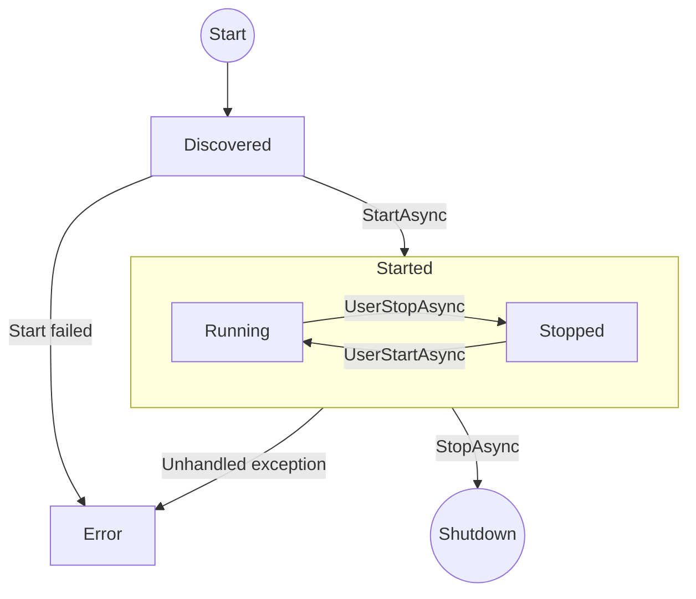

# Plugin System

## Overview

The server is built around a plugin architecture. All major subsystems - capture sources, recording formats, camera providers, notification delivery, analytics, authentication, authorization - are behind extension point interfaces. There are no privileged internal code paths.

The server core is a host that wires plugins together, manages lifecycle, and provides shared services. All domain behavior lives in plugins.

## Plugin Structure

A plugin is a .NET assembly containing one or more classes that implement extension point interfaces. Each plugin has a single entry point class implementing `IPlugin`. The plugin provides extension points by implementing the corresponding interfaces on the same class (e.g. `SqlitePlugin : IPlugin, IDataProvider`). The host discovers them via reflection.

```csharp
public interface IPlugin
{
    PluginMetadata Metadata { get; }
    OneOf<Success, Error> Initialize(PluginContext context);
    Task<OneOf<Success, Error>> StartAsync(CancellationToken ct);
    Task<OneOf<Success, Error>> StopAsync(CancellationToken ct);
}
```

`Metadata` provides the plugin's identity:

```csharp
public record PluginMetadata
{
    public required string Id { get; init; }
    public required string Name { get; init; }
    public required string Version { get; init; }
    public string? Description { get; init; }
}
```

`PluginContext` provides the services the plugin needs:

```csharp
public sealed class PluginContext
{
    public required IConfig Config { get; init; }
    public required IEventBus EventBus { get; init; }
    public required IDataStore DataStore { get; init; }
    public required ICameraRegistry CameraRegistry { get; init; }
    public required IStreamTap StreamTap { get; init; }
    public required IRecordingAccess RecordingAccess { get; init; }
}
```

## Lifecycle



1. **Discovered** - the plugin host scans the `plugins/` directory, loads the assembly, and instantiates `IPlugin`. The plugin is not yet initialized or started.
2. **Started** - `StartAsync` completes during server startup. The plugin enters the Started subgraph. For plugins implementing `IUserStartable`, transitions between Running and Stopped within this subgraph are controlled by the plugin and the user via the API. Plugins may start in either Running or Stopped depending on their own logic.
3. **Error** - `StartAsync` failed or an unhandled exception occurred.


Plugins that do not implement `IUserStartable` cannot be stopped by the user - they are either `discovered`, `running`, or `error`. Their `StopAsync` is only called on server shutdown.

### IUserStartable

Plugins with user-controlled lifecycle events (scheduling, background processing, event subscriptions, etc.) implement `IUserStartable`:

```csharp
public interface IUserStartable
{
    Task<OneOf<Success, Error>> UserStartAsync(CancellationToken ct);
    Task<OneOf<Success, Error>> UserStopAsync(CancellationToken ct);
}
```

The `POST /api/v1/plugins/{id}/start` and `POST /api/v1/plugins/{id}/stop` endpoints delegate to these methods. Plugins that do not implement `IUserStartable` return `Unavailable` from these endpoints.

### API Status Values

| Status | Meaning |
|--------|---------|
| `discovered` | Loaded but not yet started (server still starting up) |
| `running` | Active |
| `stopped` | User-stopped via `IUserStartable` (only for plugins that implement it) |
| `error` | Start failed or unhandled exception |

## Extension Points

Extension points are interfaces defined in the `Shared.Models` assembly. A plugin provides extension points by implementing the corresponding interfaces on its `IPlugin` class. The host discovers them via reflection. When multiple plugins implement the same extension point, the system uses all of them.

### ICaptureSource

Acquires video from a source and produces raw NAL units.

```csharp
public interface ICaptureSource
{
    string Protocol { get; }
    Task<OneOf<IStreamConnection, Error>> ConnectAsync(CameraConnectionInfo info, CancellationToken ct);
}

public interface IStreamConnection : IAsyncDisposable
{
    Task<OneOf<IAsyncEnumerable<NalUnit>, Error>> ReadNalUnitsAsync(CancellationToken ct);
    StreamInfo Info { get; }
}
```

Plugins could implement capture from RTSP (TCP interleaved), files, RTMP, or proprietary protocols.

### IStreamFormat

Muxes stream data into a container format for storage and demuxes for playback. Handles any streamable data type - video (H.264/265), audio, motion metadata, or future data types.

```csharp
public interface IStreamFormat
{
    string FormatId { get; }
    string FileExtension { get; }
    OneOf<ISegmentWriter, Error> CreateWriter(Stream output, CodecInfo codec);
    OneOf<ISegmentReader, Error> CreateReader(Stream input);
}

public interface ISegmentWriter : IAsyncDisposable
{
    Task<OneOf<Success, Error>> WriteNalUnitAsync(NalUnit unit, CancellationToken ct);
    Task<OneOf<Success, Error>> FinalizeAsync(CancellationToken ct);
    IReadOnlyList<KeyframeEntry> Keyframes { get; }
}

public interface ISegmentReader : IAsyncDisposable
{
    Task<OneOf<Success, Error>> SeekToKeyframeAsync(long byteOffset, CancellationToken ct);
    Task<OneOf<IAsyncEnumerable<Fragment>, Error>> ReadFragmentsAsync(CancellationToken ct);
}
```

Plugins could implement fragmented MP4, MKV, raw HEVC, or other formats. Metadata profiles (e.g. motion) use a lightweight format suited to their data type.

### ICameraProvider

Handles camera-specific discovery, configuration, and capability detection.

```csharp
public interface ICameraProvider
{
    string ProviderId { get; }
    Task<OneOf<IReadOnlyList<DiscoveredCamera>, Error>> DiscoverAsync(DiscoveryOptions options, CancellationToken ct);
    Task<OneOf<CameraConfiguration, Error>> ConfigureAsync(string address, Credentials credentials, CancellationToken ct);
    Task<OneOf<IEventSubscription?, Error>> SubscribeEventsAsync(CameraConfiguration config, CancellationToken ct);
}
```

Plugins could implement ONVIF (full discovery, events, analytics), generic RTSP (manual URI, no discovery), or vendor-specific providers (e.g. Amcrest, Reolink) that expose features not available through standard ONVIF.

### IEventFilter

Processes raw events before they are stored or delivered to clients. Filters can suppress, modify, or enrich events.

```csharp
public interface IEventFilter
{
    string FilterId { get; }
    Task<OneOf<EventDecision, Error>> ProcessAsync(CameraEvent rawEvent, CancellationToken ct);
}

public enum EventDecision
{
    Pass,
    Suppress,
}
```

Plugins could implement motion zone filtering, object detection filtering, time-based schedules, or deduplication.

### INotificationSink

Delivers event notifications to external systems. All registered sinks receive events that pass filtering.

```csharp
public interface INotificationSink
{
    string SinkId { get; }
    Task<OneOf<Success, Error>> SendAsync(CameraEvent evt, CancellationToken ct);
}
```

Plugins could implement client push over QUIC, email (SMTP), webhooks, Pushover, Telegram, etc.

### IVideoAnalyzer

Extension point for features that require decoding and analyzing video (object detection, face recognition, license plate reading, etc.).

```csharp
public interface IVideoAnalyzer
{
    string AnalyzerId { get; }
    IReadOnlyList<string> SupportedCodecs { get; }
    Task<OneOf<Success, Error>> StartAsync(Guid cameraId, string profile, CancellationToken ct);
    Task<OneOf<Success, Error>> StopAsync(Guid cameraId, string profile, CancellationToken ct);
}
```

The analyzer is responsible for its own pipeline: it subscribes to raw NAL units via `IStreamTap`, decodes them (CPU or GPU), performs analysis, and publishes results to `IEventBus`. The server never decodes video - that is entirely the analyzer plugin's concern.

Analysis results flow through the normal event filter > notification pipeline.

### IStorageProvider

An opaque store for recording data. The provider manages its own internal path/key scheme - callers identify data by metadata (camera, profile, time range), not paths. The provider is instantiated with whatever configuration it needs (mount point, bucket, connection string, etc.).

```csharp
public interface IStorageProvider
{
    string ProviderId { get; }

    Task<OneOf<ISegmentHandle, Error>> CreateSegmentAsync(SegmentMetadata metadata, CancellationToken ct);
    Task<OneOf<Stream, Error>> OpenReadAsync(string segmentRef, CancellationToken ct);
    Task<OneOf<Success, Error>> PurgeAsync(IReadOnlyList<string> segmentRefs, CancellationToken ct);
    Task<OneOf<StorageStats, Error>> GetStatsAsync(CancellationToken ct);
}

public interface ISegmentHandle : IAsyncDisposable
{
    string SegmentRef { get; }
    Stream Stream { get; }
    Task<OneOf<Success, Error>> FinalizeAsync(CancellationToken ct);
}

public record SegmentMetadata
{
    public required Guid CameraId { get; init; }
    public required string Profile { get; init; }
    public required ulong StartTime { get; init; }
    public required string Codec { get; init; }
}

public record StorageStats
{
    public required long TotalBytes { get; init; }
    public required long UsedBytes { get; init; }
    public required long FreeBytes { get; init; }
    public required long RecordingBytes { get; init; }
}
```

`CreateSegmentAsync` receives metadata describing what is being stored. The provider decides internally how to organize the data (directory structure, S3 keys, database blobs, etc.) and returns a handle with an opaque `SegmentRef` string. This ref is stored in the database index and used for all subsequent reads and deletes - the caller never knows or cares how the provider maps it to physical storage.

The retention engine (part of the server core) subscribes to `RecordingSegmentCompleted` events and periodically evaluates retention policies. It determines *which* segments to delete (based on age, total size, or free space percentage) and calls `PurgeAsync` with the opaque segment refs.

**Storage duration estimation:** The server tracks recording byte rate over a rolling window (bytes written per unit time, per camera). Combined with `FreeBytes` from `StorageStats`, this gives an estimated remaining recording duration. This calculation lives in the server core - the provider just reports accurate space figures.

Plugins could implement filesystem (NFS, local, any mounted filesystem), S3, SMB, or other backends. Non-filesystem backends may not support all space reporting - `TotalBytes` and `FreeBytes` can return `-1` to indicate "unknown", in which case percentage-based retention and duration estimation are unavailable.

### IDataProvider

Provides metadata storage for the server - cameras, streams, segments, events, clients, retention rules, settings, and any other structured data. The server core works against this abstraction; the specific database engine is an implementation detail.

```csharp
public interface IDataProvider
{
    string ProviderId { get; }

    ICameraRepository Cameras { get; }
    IStreamRepository Streams { get; }
    ISegmentRepository Segments { get; }
    IKeyframeRepository Keyframes { get; }
    IEventRepository Events { get; }
    IClientRepository Clients { get; }
    IConfigRepository Config { get; }

    IDataStore GetDataStore(string pluginId);
}
```

Each repository interface defines the queries the server core needs (CRUD, time-range queries, keyframe lookups, etc.). See [data-model.md](data-model.md) for the full return type contracts.

The data provider manages its own storage - a SQL-based provider manages its own database files/connections, a cloud-based provider manages its own credentials and endpoints. The server core does not dictate where or how the data is stored, only what queries it needs to perform. Migration is handled internally during the plugin's `StartAsync` (see [Configuration > Migration](#migration)).

### IAuthProvider

Authenticates HTTP requests. When no auth provider is installed, HTTP endpoints are unauthenticated.

```csharp
public interface IAuthProvider
{
    Task<OneOf<AuthResult, Error>> AuthenticateAsync(HttpContext context, CancellationToken ct);
    Task<OneOf<Success, Error>> ChallengeAsync(HttpContext context, CancellationToken ct);
}

public record AuthResult(bool Authenticated, string? Identity, IDictionary<string, string>? Claims);
```

When no `IAuthProvider` is installed, HTTP is open on LAN by default. Plugins could add basic auth, OIDC, LDAP, or a simple PIN gate.

### IAuthzProvider

Authorizes operations and filters results based on identity. Receives an opaque identity string (QUIC client ID from certificate, or the identifier returned by `IAuthProvider` on HTTP) and decides what is permitted. Mapping identities to accounts, roles, or permissions is the provider's responsibility.

```csharp
public interface IAuthzProvider
{
    Task<OneOf<bool, Error>> AuthorizeAsync(string? identity, string operation, object? resource, CancellationToken ct);
    Task<OneOf<IQueryable<T>, Error>> FilterAsync<T>(string? identity, IQueryable<T> query, CancellationToken ct);
}
```

When no `IAuthzProvider` is installed, all identities have unrestricted access.

### IPluginSettings

Plugins with user-facing settings implement `IPluginSettings`. The plugin advertises a schema describing what the UI should present, provides current values, and receives user-set values for validation and application.

```csharp
public interface IPluginSettings
{
    IReadOnlyList<SettingGroup> GetSchema();
    IReadOnlyDictionary<string, object> GetValues();
    OneOf<Success, Error> ValidateValue(string key, object value);
    OneOf<Success, Error> ApplyValues(IReadOnlyDictionary<string, object> values);
}

public record SettingGroup
{
    public required string Key { get; init; }
    public required int Order { get; init; }
    public required string Label { get; init; }
    public string? Description { get; init; }
    public required IReadOnlyList<SettingField> Fields { get; init; }
}

public record SettingField
{
    public required string Key { get; init; }
    public required int Order { get; init; }
    public required string Label { get; init; }
    public required string Type { get; init; }
    public string? Description { get; init; }
    public object? DefaultValue { get; init; }
    public bool Required { get; init; }
}
```

`GetSchema` returns groups of fields for the UI to render in order. `GetValues` returns the current values keyed by field key. `ValidateValue` validates a single field value before submission (for inline validation in the UI). `ApplyValues` validates and persists the full set. Plugins that have no user-facing settings do not implement `IPluginSettings`.

The API endpoints `OPTIONS/GET/PUT /api/v1/plugins/{id}/config` delegate to these methods. The host looks up the plugin by ID and calls the methods directly on the `IPlugin` instance.

## Plugin Services

Plugins receive shared services via `PluginContext` during initialization. These services are provided by the plugin host and give plugins access to system state and data.

### IEventBus

Publish and subscribe to system events.

```csharp
public interface IEventBus
{
    Task<OneOf<Success, Error>> PublishAsync<T>(T evt, CancellationToken ct) where T : ISystemEvent;
    Task<OneOf<IAsyncEnumerable<T>, Error>> SubscribeAsync<T>(CancellationToken ct) where T : ISystemEvent;
}
```

Event types include camera status changes, stream lifecycle, recording segment completion, motion detection, client connections, and any plugin-defined events.

### IStreamTap

Subscribe to raw NAL unit streams from active cameras.

```csharp
public interface IStreamTap
{
    Task<OneOf<IAsyncEnumerable<NalUnit>, Error>> TapAsync(Guid cameraId, string profile, CancellationToken ct);
}
```

Used by video analyzers and any plugin that needs access to the raw video stream without intercepting the recording pipeline.

### IRecordingAccess

Query and read recording segments.

```csharp
public interface IRecordingAccess
{
    Task<OneOf<IReadOnlyList<SegmentInfo>, Error>> QueryAsync(Guid cameraId, string profile, ulong from, ulong to, CancellationToken ct);
    Task<OneOf<Stream, Error>> OpenSegmentAsync(string segmentRef, CancellationToken ct);
}
```

`OpenSegmentAsync` takes the opaque `segmentRef` from `SegmentInfo` (which came from the storage provider) and delegates to the provider to open the data for reading.

### ICameraRegistry

Enumerate cameras and stream profiles.

```csharp
public interface ICameraRegistry
{
    Task<OneOf<IReadOnlyList<CameraInfo>, Error>> GetCamerasAsync(CancellationToken ct);
    Task<OneOf<CameraInfo, Error>> GetCameraAsync(Guid cameraId, CancellationToken ct);
}
```

### IConfig

Private key-value configuration store for the plugin. The plugin reads and writes its own internal configuration here (e.g. database path, connection strings, polling intervals). These values are not directly exposed to the user.

```csharp
public interface IConfig
{
    T Get<T>(string key, T defaultValue);
    void Set<T>(string key, T value);
}
```

The plugin host provides a per-plugin `IConfig` instance via `PluginContext`. The backing store is transparent to the plugin:

- **Data provider plugins** (`IDataProvider`): backed by `{data-path}/dataProviderConfig.json`
- **All other plugins**: backed by `IDataStore` (via the active data provider)

### IDataStore

Per-plugin isolated data store for internal state that is not configuration (e.g. accounts, sessions, learned data, cache). Always backed by the active data provider.

Plugins are not required to use this. A plugin that prefers its own storage is free to manage it independently.

See [data-model.md](data-model.md) for the full interface definition.

## Plugin Loading

Plugin loading has two phases: discovery (at startup) and starting (after setup is complete).

### Discovery

On startup, the plugin host immediately:

1. Scans the `plugins/` directory for `.dll` assemblies
2. Loads each assembly into an isolated `AssemblyLoadContext`
3. Finds types implementing `IPlugin` and instantiates them
4. Detects which extension point interfaces each plugin class implements

After discovery, no plugins are initialized or running. The server begins listening on HTTP. The web UI can enumerate discovered plugins (e.g. to let the setup wizard present data provider options).


### Initialization and Starting

During setup (before certificates exist), the host creates temporary instances of all data provider plugins and calls `Initialize` with a `PluginContext` containing `DataProviderConfig` as `IConfig`. These temporary instances serve the setup wizard (the web UI queries their `IPluginSettings` to present configuration options). They are discarded once setup completes.

Once the server has certificates and a configured data provider:

1. All plugins are discovered fresh (new instances).
2. The host calls `Initialize` then `StartAsync` on the active data provider plugin. The data provider connects and runs schema migration.
3. The host calls `Initialize` then `StartAsync` on all remaining plugins.
4. On shutdown, plugins are stopped in reverse order.

See [Configuration](#configuration) for how `IConfig` is routed per plugin type.

### Isolation

Each plugin runs in its own `AssemblyLoadContext`, providing:

- Assembly version isolation (two plugins can depend on different versions of the same library)
- Clean unload when a plugin is stopped (assemblies are unloaded with the context)

Plugins receive services from the host via `PluginContext` but cannot access each other's internals directly. Inter-plugin communication goes through the event bus.

### Configuration

Plugin configuration has three layers:

- **`IConfig`** - private key-value store the plugin uses internally. The plugin host routes storage transparently based on plugin type (see below).
- **`IPluginSettings`** - user-facing settings with schema, validation, and apply. The API endpoints `GET/PUT /api/v1/plugins/{id}/config` delegate to this. Plugins without user-facing settings do not implement it.
- **`IDataStore`** - arbitrary internal state (not configuration). Always DB-backed.

The plugin host routes `IConfig` storage based on plugin type:

- **Data provider plugins** (`IDataProvider`): backed by `{data-path}/dataProviderConfig.json` (via `DataProviderConfig`). This file also identifies which data provider plugin is active (by assembly name). This is necessary because the database is not available before the data provider connects.
- **All other plugins**: backed by `IConfigRepository` (namespaced by plugin ID) via the active data provider.

This routing is transparent to the plugin - it uses `IConfig` the same way regardless of type.

#### dataProviderConfig.json

```json
{
  "active": "Sqlite",
  "providers": {
    "Sqlite": {
      "path": "server.db"
    },
    "Postgres": {
      "connectionString": "Host=..."
    }
  }
}
```

| Field | Type | Description |
|-------|------|-------------|
| `active` | string | Assembly name of the active data provider |
| `providers` | object | Per-provider configuration keyed by assembly name, passed to `IConfig` |

The `active` field determines which provider starts. A provider's config entry is created when its configuration is first saved. If `dataProviderConfig.json` does not exist (first run), no data provider is active and the setup wizard must be completed. Changing the active data provider requires a server restart.

### Migration

Each data provider plugin is responsible for its own schema migration. Migration runs during `StartAsync` - the `IDataProvider` interface does not expose a migration method. The server does not manage or orchestrate migration.

## Debug Tags

Plugins claim one or more module IDs in the `0x1000-0xFFFF` range for their debug tags (see [response-model.md](response-model.md)). Module ID allocation is declared in the plugin metadata and validated by the host to prevent collisions.
