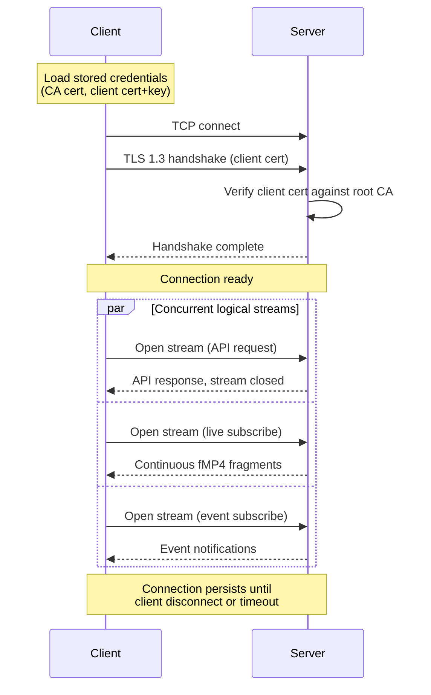

# Client Protocol

## Overview

All native client communication uses a custom binary protocol over a single TCP connection secured with mutual TLS. API requests, live video streams, playback, and event notifications are multiplexed as independent logical streams over one connection.

The HTTP API exists solely for the web UI and client enrollment on the local network. Native clients never use HTTP.


## Transport

| Property | Value |
|----------|-------|
| Transport | TCP |
| Port | 4433 (configurable) |
| Encryption | TLS 1.3 via `SslStream` |
| Authentication | Mutual TLS with client certificates |

## Connection Lifecycle



### Address Selection

The client stores an ordered list of addresses from enrollment (local addresses first). On connection:

1. Try each address in order, use whichever connects first
2. When connected via a later address, periodically re-probe earlier addresses and switch if one becomes available

### Reconnection

- On connection loss, reconnect immediately with exponential backoff (100ms > 200ms > 400ms > ... > 30s cap)
- TLS session tickets enable fast resumption on reconnect
- Live stream subscriptions are re-established automatically after reconnect
- The client maintains a generation counter; stale responses from pre-reconnect streams are discarded

## Versioning

The protocol version is sent as the first message after the TLS handshake completes. The client sends a version announcement on stream ID 0 before any other traffic.

**What requires a version bump:** Removing or changing the meaning of a required field, changing framing layout, removing a stream type - any breaking change.

**What does not:** Adding new optional fields to messages (MessagePack ignores unknown fields), adding new stream types (unknown types are cleanly rejected), adding new result codes (clients treat unknown results as a generic failure).

**Version announcement (stream 0, first message):**

| Field | Type | Description |
|-------|------|-------------|
| `version` | uint | Protocol version number (currently `1`) |

The server responds with its own version announcement. If the versions are incompatible, the server closes the connection. The client should present a clear "update required" message.

## Multiplexing

All communication over the TCP connection is multiplexed into logical streams. Each logical stream has a unique 4-byte stream ID and carries one stream type (API request, live subscribe, etc.).

### Stream IDs

- Stream ID 0 is reserved for connection-level control (keepalive)
- Client-initiated streams use odd IDs (1, 3, 5, ...)
- Server-initiated streams use even IDs (2, 4, 6, ...)
- IDs are allocated sequentially and never reused within a connection

### Stream Lifecycle

A new logical stream is opened by sending a message with a previously unused stream ID. The first message on a new stream must contain the 2-byte stream type header as its payload.

Stream 0 is an exception: it is implicitly open from connection start, carries the version announcement as its first message, and then serves as the keepalive channel for the lifetime of the connection.

A stream is closed by sending a message with the `FIN` flag (bit 15) set. After closing, no further messages may be sent on that stream ID.

## Stream Types

Stream types are organized into ranges by category:

| Range | Category | Description |
|-------|----------|-------------|
| `0x0000` | Reserved | |
| `0x0100 - 0x01FF` | Control | Connection management |
| `0x0200 - 0x02FF` | API | Request-response operations |
| `0x0300 - 0x03FF` | Video | Live and recorded video streams |
| `0x0400 - 0x04FF` | Events | Event delivery |
| `0x1000 - 0x1FFF` | Plugin | Reserved for plugin-defined stream types |

### Defined Stream Types

| Type | Value | Direction | Description |
|------|-------|-----------|-------------|
| Keepalive | `0x0100` | Bidirectional | Connection health check |
| API Request | `0x0200` | Client > Server | Request-response API call |
| Live Subscribe | `0x0300` | Client > Server | Subscribe to a camera's live stream |
| Playback | `0x0301` | Client > Server | Request recorded video from a timestamp |
| Event Channel | `0x0400` | Client > Server (subscribe), Server > Client (events) | Event notification subscription |

### Framing

Every message on the wire uses the following envelope:

```
┌──────────────┬──────────────┬───────────────┬──────────────────┐
│ Stream ID    │ Flags        │ Length        │ Payload          │
│ 4 bytes (LE) │ 2 bytes (LE) │ 4 bytes (LE)  │ {Length} bytes   │
└──────────────┴──────────────┴───────────────┴──────────────────┘
```

- **Stream ID**: Identifies which logical stream this message belongs to.
- **Flags**: 16-bit field. Bits 14-15 are reserved for framing control (see below). Lower bits are type-specific. Unused bits must be 0.
- **Length**: Payload length in bytes, little-endian uint. Max 16 MiB per message.
- **Payload**: Serialized message data (MessagePack). API request and response bodies are JSON (see [api.md](api.md)).

**Common flag bits (all stream types):**

| Bit | Name | Description |
|-----|------|-------------|
| 14 | `ERR` | This message signals an error; an error envelope follows |
| 15 | `FIN` | Stream close; no further messages on this stream ID |

The first message on a new stream ID carries the 2-byte stream type header as its payload. Subsequent messages on that stream ID carry type-specific data.

### 0x0100 - Keepalive

Operates on stream ID 0, which is implicitly open for the lifetime of the connection (no stream type header is sent). Either side may send a keepalive. The other side responds with a keepalive in return. If no keepalive response is received within 10 seconds, the connection is considered dead.

**Keepalive message:**

| Field | Type | Description |
|-------|------|-------------|
| `echo` | ulong | Opaque value; responder copies this into the reply |

Keepalives are sent every 15 seconds if no other traffic has occurred.

### 0x0200 - API Request

Used for request-response API calls. One logical stream per request (opened by client, closed after response).

**Request message:**

| Field | Type | Description |
|-------|------|-------------|
| `method` | string | HTTP-style method: `GET`, `POST`, `PUT`, `DELETE` |
| `path` | string | API path, e.g. `/api/v1/cameras`, `/api/v1/cameras/{id}` |
| `body` | bytes? | Optional request body (JSON) |

**Response message:**

Uses the standard response envelope defined in [response-model.md](response-model.md):

| Field | Type | Description |
|-------|------|-------------|
| `result` | enum | Operation outcome |
| `debugTag` | uint | Module-specific code identifying the code path |
| `message` | string? | Human-readable explanation (non-success) |
| `body` | bytes? | Optional response body (JSON) |

**Flags (request):**

| Bit | Name | Description |
|-----|------|-------------|
| 0 | `HAS_BODY` | Payload includes a request body |
| 1-13 | Reserved | |

**Flags (response):**

| Bit | Name | Description |
|-----|------|-------------|
| 0 | `HAS_BODY` | Payload includes a response body |
| 1-13 | Reserved | |

The client sends one request message, then the server sends one response message, then both sides close the stream.

### 0x0300 - Live Subscribe

Client opens a stream to subscribe to a camera's live video. The server sends a continuous sequence of fMP4 fragments until the client closes the stream.

**Subscribe message (client > server):**

| Field | Type | Description |
|-------|------|-------------|
| `cameraId` | Guid | Camera identifier |
| `profile` | string | Stream profile name (e.g. `main`, `sub`) |

**Fragment messages (server > client):**

| Field | Type | Description |
|-------|------|-------------|
| `timestamp` | ulong | PTS in Unix microseconds |
| `data` | bytes | fMP4 fragment (`moof` + `mdat`) |

**Flags (fragment):**

| Bit | Name | Description |
|-----|------|-------------|
| 0 | `KEYFRAME` | Fragment begins with a keyframe |
| 1 | `INIT` | Fragment is an init segment (`ftyp` + `moov`); sent first |
| 2-13 | Reserved | |

The server sends the init segment (flag `INIT`) as the first message, followed by a continuous sequence of fragment messages. The client can close the stream at any time to unsubscribe.

### 0x0301 - Playback

Client opens a stream to request recorded video starting from a timestamp. The server seeks to the nearest keyframe and streams fMP4 data.

**Playback request (client > server):**

| Field | Type | Description |
|-------|------|-------------|
| `cameraId` | Guid | Camera identifier |
| `profile` | string | Stream profile name |
| `from` | ulong | Start timestamp in Unix microseconds |
| `to` | ulong? | Optional end timestamp; omit for open-ended playback |

**Playback messages (server > client):**

Same as live fragment messages. The server sends an init segment first, then fragments in chronological order.

**Flags (request):**

| Bit | Name | Description |
|-----|------|-------------|
| 0 | `HAS_END` | Request includes an end timestamp |
| 1-13 | Reserved | |

When the server reaches the end timestamp (or runs out of recorded data), it closes the stream with a `FIN` message.

The client can seek by closing the current playback stream and opening a new one with a different `from` timestamp. Opening a new logical stream on the same TCP connection is cheap - no additional handshake.

### 0x0400 - Event Channel

Client opens a single long-lived stream to subscribe to events. The server sends event notifications on this stream for the lifetime of the connection.

**Subscribe message (client > server):** Empty payload (the stream type identifier is sufficient).

**Event messages (server > client):**

| Field | Type | Description |
|-------|------|-------------|
| `id` | Guid | Event identifier |
| `cameraId` | Guid | Source camera |
| `type` | string | Event type (e.g. `motion`, `tamper`, `disconnect`) |
| `startTime` | ulong | Event start in Unix microseconds |
| `endTime` | ulong? | Event end in Unix microseconds, null if instantaneous or ongoing |
| `metadata` | map? | Type-specific metadata |

**Flags:**

| Bit | Name | Description |
|-----|------|-------------|
| 0 | `START` | Event started |
| 1 | `END` | Event ended (sent as a follow-up for duration events) |
| 2-13 | Reserved | |

## Error Handling

All responses use the response model defined in [response-model.md](response-model.md) - a `result` enum for control flow and a `debugTag` for traceability, shared across tunnel and HTTP paths.

**On API streams (0x0200):** The response message contains the full response envelope (`result`, `debugTag`, `message`, `body`).

**On other stream types:** Errors are signaled by sending a message with the `ERR` flag (bit 14) set. The payload contains the error envelope:

| Field | Type | Description |
|-------|------|-------------|
| `result` | enum | Operation outcome |
| `debugTag` | uint | Module-specific code identifying the failure site |
| `message` | string | Human-readable description |

The `ERR` and `FIN` flags are typically set together to signal an error and close the stream in one message.

On success, the initial acknowledgement message on non-API streams includes `debugTag` for traceability.

## Serialization

All structured payloads use [MessagePack](https://msgpack.org/) for serialization:

- Compact binary format (smaller than JSON, faster to parse)
- Schema-less (forward/backward compatible - unknown fields are ignored)
- Wide language support (.NET: `MessagePack-CSharp`)

Video data (`data` field in fragments) is raw bytes, not MessagePack-encoded. API request and response bodies are JSON (see [api.md](api.md)).

## Flow Control

The server manages back-pressure per client:

- If a client cannot consume live video fast enough, the server drops non-keyframe fragments and sends the next keyframe
- Playback streams deliver data as fast as the client can consume, throttled by TCP flow control
- The server limits total outbound bandwidth per client (configurable, default unlimited on LAN)
