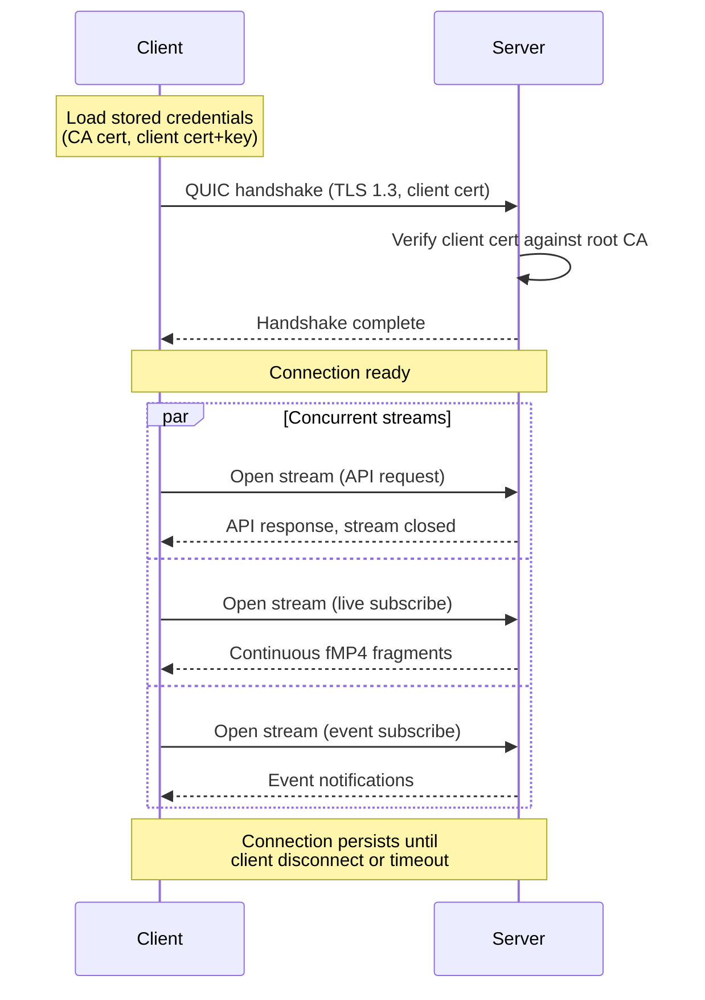

# QUIC Protocol

## Overview

All native client communication uses a custom protocol over QUIC. A single UDP port carries API requests, live video streams, playback, and event notifications - multiplexed over independent QUIC streams with no head-of-line blocking.

The HTTP API exists solely for the web UI and client enrollment on the local network. Native clients never use HTTP.


## Transport

| Property | Value |
|----------|-------|
| Transport | QUIC (RFC 9000) via `System.Net.Quic` / msquic |
| Port | UDP 443 (configurable) |
| Encryption | TLS 1.3 (built into QUIC) |
| Authentication | Mutual TLS with client certificates |
| Max concurrent streams | Unlimited (per QUIC spec, negotiated) |

## Connection Lifecycle



### Address Selection

The client stores an ordered list of addresses from enrollment (local addresses first). On connection:

1. Try each address in order, use whichever connects first
2. When connected via a later address, periodically re-probe earlier addresses and switch if one becomes available

### Reconnection

- On connection loss, reconnect immediately with exponential backoff (100ms > 200ms > 400ms > ... > 30s cap)
- QUIC 0-RTT is used for fast reconnection when the server's session ticket is still valid
- Live stream subscriptions are re-established automatically after reconnect
- The client maintains a generation counter; stale responses from pre-reconnect streams are discarded

## Versioning

The protocol version is negotiated via ALPN during the QUIC handshake.

- Current ALPN: `<name>/1`
- The server may support multiple ALPN versions simultaneously
- Clients include supported versions in the ALPN list; the server selects the highest mutually supported version
- If no mutually supported version exists, the handshake fails

**What requires a version bump:** Removing or changing the meaning of a required field, changing framing layout, removing a stream type - any breaking change.

**What does not:** Adding new optional fields to messages (MessagePack ignores unknown fields), adding new stream types (unknown types are cleanly rejected), adding new result codes (clients treat unknown results as a generic failure).

When the server bumps the protocol version, clients that haven't updated will fail the ALPN negotiation and should present a clear "update required" message.

## Stream Types

Each QUIC stream begins with a 2-byte type identifier (ushort, little-endian) followed by type-specific framing.

Stream types are organized into ranges by category:

| Range | Category | Description |
|-------|----------|-------------|
| `0x0000` | Reserved | |
| `0x0100 - 0x01FF` | Control | Connection management |
| `0x0200 - 0x02FF` | API | Request-response operations |
| `0x0300 - 0x03FF` | Video | Live and recorded video streams |
| `0x0400 - 0x04FF` | Events | Event delivery |
| `0x1000 - 0x1FFF` | Plugin | Reserved for plugin-defined stream types |

### Defined Stream Types

| Type | Value | Direction | Description |
|------|-------|-----------|-------------|
| Keepalive | `0x0100` | Bidirectional | Connection health check |
| API Request | `0x0200` | Client > Server | Request-response API call |
| Live Subscribe | `0x0300` | Client > Server | Subscribe to a camera's live stream |
| Playback | `0x0301` | Client > Server | Request recorded video from a timestamp |
| Event Channel | `0x0400` | Client > Server (subscribe), Server > Client (events) | Event notification subscription |

### Framing

All stream types use a common message envelope after the initial type identifier:

```
Stream header (first message only):
┌──────────────────┐
│ Stream Type      │
│ 2 bytes (LE)     │
└──────────────────┘

Each message:
┌──────────────┬───────────────┬──────────────────┐
│ Flags        │ Length        │ Payload          │
│ 2 bytes (LE) │ 4 bytes (LE)  │ {Length} bytes   │
└──────────────┴───────────────┴──────────────────┘
```

- **Stream Type**: Identifies the stream's purpose. Sent once as the first 2 bytes of the stream.
- **Flags**: 16-bit field. Interpretation is type-specific. Reserved bits must be 0.
- **Length**: Payload length in bytes, little-endian uint. Max 16 MiB per message.
- **Payload**: Serialized message data (MessagePack).

### 0x0100 - Keepalive

Either side may send a keepalive. The other side responds with a keepalive in return. If no keepalive response is received within 10 seconds, the connection is considered dead.

**Keepalive message:**

| Field | Type | Description |
|-------|------|-------------|
| `echo` | ulong | Opaque value; responder copies this into the reply |

Keepalives are sent every 15 seconds if no other traffic has occurred.

### 0x0200 - API Request

Used for request-response API calls. One QUIC stream per request (opened by client, closed after response).

**Request message:**

| Field | Type | Description |
|-------|------|-------------|
| `method` | string | HTTP-style method: `GET`, `POST`, `PUT`, `DELETE` |
| `path` | string | API path, e.g. `/api/v1/cameras`, `/api/v1/cameras/{id}` |
| `body` | bytes? | Optional request body (MessagePack-encoded) |

**Response message:**

Uses the standard response envelope defined in [response-model.md](response-model.md):

| Field | Type | Description |
|-------|------|-------------|
| `result` | enum | Operation outcome |
| `debugTag` | uint | Module-specific code identifying the code path |
| `message` | string? | Human-readable explanation (non-success) |
| `body` | bytes? | Optional response body (MessagePack-encoded) |

**Flags (request):**

| Bit | Name | Description |
|-----|------|-------------|
| 0 | `HAS_BODY` | Payload includes a request body |
| 1-15 | Reserved | |

**Flags (response):**

| Bit | Name | Description |
|-----|------|-------------|
| 0 | `HAS_BODY` | Payload includes a response body |
| 1-15 | Reserved | |

The client sends one request message, then the server sends one response message, then both sides close the stream.

### 0x0300 - Live Subscribe

Client opens a stream to subscribe to a camera's live video. The server sends a continuous sequence of fMP4 fragments until the client closes the stream.

**Subscribe message (client > server):**

| Field | Type | Description |
|-------|------|-------------|
| `cameraId` | Guid | Camera identifier |
| `profile` | string | Stream profile name (e.g. `main`, `sub`) |

**Fragment messages (server > client):**

| Field | Type | Description |
|-------|------|-------------|
| `timestamp` | ulong | PTS in Unix microseconds |
| `data` | bytes | fMP4 fragment (`moof` + `mdat`) |

**Flags (fragment):**

| Bit | Name | Description |
|-----|------|-------------|
| 0 | `KEYFRAME` | Fragment begins with a keyframe |
| 1 | `INIT` | Fragment is an init segment (`ftyp` + `moov`); sent first |
| 2-15 | Reserved | |

The server sends the init segment (flag `INIT`) as the first message, followed by a continuous sequence of fragment messages. The client can close the stream at any time to unsubscribe.

### 0x0301 - Playback

Client opens a stream to request recorded video starting from a timestamp. The server seeks to the nearest keyframe and streams fMP4 data.

**Playback request (client > server):**

| Field | Type | Description |
|-------|------|-------------|
| `cameraId` | Guid | Camera identifier |
| `profile` | string | Stream profile name |
| `from` | ulong | Start timestamp in Unix microseconds |
| `to` | ulong? | Optional end timestamp; omit for open-ended playback |

**Playback messages (server > client):**

Same as live fragment messages. The server sends an init segment first, then fragments in chronological order.

**Flags (request):**

| Bit | Name | Description |
|-----|------|-------------|
| 0 | `HAS_END` | Request includes an end timestamp |
| 1-15 | Reserved | |

When the server reaches the end timestamp (or runs out of recorded data), it sends a final message with length 0, then closes its side of the stream.

The client can seek by closing the current playback stream and opening a new one with a different `from` timestamp. This is cheap - QUIC stream creation has no round-trip overhead.

### 0x0400 - Event Channel

Client opens a single long-lived stream to subscribe to events. The server sends event notifications on this stream for the lifetime of the connection.

**Subscribe message (client > server):** Empty payload (the stream type identifier is sufficient).

**Event messages (server > client):**

| Field | Type | Description |
|-------|------|-------------|
| `id` | Guid | Event identifier |
| `cameraId` | Guid | Source camera |
| `type` | string | Event type (e.g. `motion`, `tamper`, `disconnect`) |
| `startTime` | ulong | Event start in Unix microseconds |
| `endTime` | ulong? | Event end in Unix microseconds, null if instantaneous or ongoing |
| `metadata` | map? | Type-specific metadata |

**Flags:**

| Bit | Name | Description |
|-----|------|-------------|
| 0 | `START` | Event started |
| 1 | `END` | Event ended (sent as a follow-up for duration events) |
| 2-15 | Reserved | |

## Error Handling

All responses use the response model defined in [response-model.md](response-model.md) - a `result` enum for control flow and a `debugTag` for traceability, shared across QUIC and HTTP paths.

**On API streams (0x0200):** The response message contains the full response envelope (`result`, `debugTag`, `message`, `body`).

**On other stream types:** Errors are signaled by sending a message with a length of 0 (empty payload) to indicate the next message is an error envelope, followed by:

| Field | Type | Description |
|-------|------|-------------|
| `result` | enum | Operation outcome |
| `debugTag` | uint | Module-specific code identifying the failure site |
| `message` | string | Human-readable description |

The sender then closes their side of the stream. This avoids any collision with stream-type-specific flags.

On success, the initial acknowledgement message on non-API streams includes `debugTag` for traceability.

**QUIC stream reset:** Used only for abrupt termination (e.g. connection loss, client cancellation). Not a substitute for the response model.

## Serialization

All structured payloads use [MessagePack](https://msgpack.org/) for serialization:

- Compact binary format (smaller than JSON, faster to parse)
- Schema-less (forward/backward compatible - unknown fields are ignored)
- Wide language support (.NET: `MessagePack-CSharp`)

Video data (`data` field in fragments) is raw bytes, not MessagePack-encoded.

## Flow Control

QUIC provides per-stream and connection-level flow control. The server respects client back-pressure:

- If a client cannot consume live video fast enough, the server drops non-keyframe fragments and sends the next keyframe
- Playback streams deliver data as fast as the client can consume, throttled by QUIC flow control
- The server limits total outbound bandwidth per client (configurable, default unlimited on LAN)
